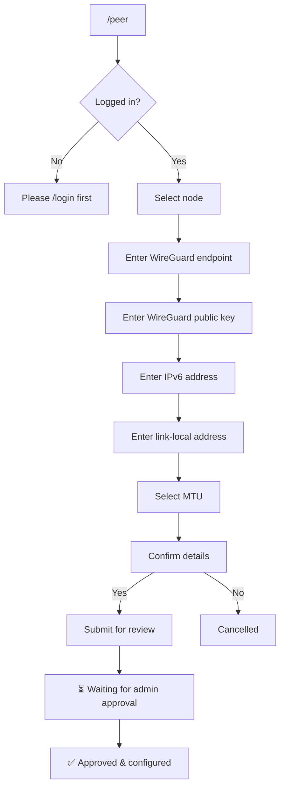

# Bot Commands

The MoeNet DN42 Bot ([@moenetdn42bot](https://t.me/moenetdn42bot)) provides a bilingual (EN/ZH) interface for peering management.

## User Commands

| Command | Description |
|---------|-------------|
| `/start`, `/help` | Show all available commands |
| `/login <ASN>` | Login with your DN42 AS number |
| `/logout` | End current session |
| `/whoami` | Show current login status |
| `/cancel` | Cancel current operation |

## Peering Commands

Requires login (`/login` first).

| Command | Description |
|---------|-------------|
| `/peer` | **The single entry for all peering.** Your peers as an inline list → tap one for a detail card with ✏️ Modify · 🗑 Delete · 📊 Status · 🔄 Restart, plus ➕ New Peer (inline creation wizard). Every action is a button tap — no per-field commands to type. |
| `/node` | Browse nodes (inline list → details). Everyone can view; admins also get add/edit/delete/bootstrap/maintenance/peers |

> `/info` `/modify` `/remove` `/status` `/restart` still work as **legacy
> aliases** for muscle memory, but they've been removed from the command menu —
> everything is reachable from inside `/peer`. The detail card also shows a
> rejected peer's reason (`⚠️ Note`).

## Network Tools

Available to all users without login.

| Command | Description |
|---------|-------------|
| `/ping <target>` | Ping from MoeNet nodes |
| `/trace <target>` | Traceroute from nodes |
| `/whois <query>` | DN42 WHOIS lookup |
| `/dig <domain>` | DNS lookup |
| `/route <prefix>` | BGP route lookup |
| `/findnoc <asn>` | Find NOC contact info |

## Admin Commands

Requires admin privileges.

| Command | Description |
|---------|-------------|
| `/node` | **Node management** — add / edit / delete (cascades sessions) / bootstrap token / maintenance / view peers. Replaces the old `/addnode`, `/delnode`, `/bootstrap`, `/nodes` |
| `/peer` | With no arg, admins get a panel: 📋 all sessions · ➕ add peer (any ASN, any node) · ⏳ pending · 🔍 by ASN. `/peer <asn>` views a specific ASN |
| `/addpeer <asn>` | Add a peer for any ASN on any node (also the panel's ➕) |
| `/pending` | List pending peer requests (✅ Approve / ❌ Reject; reject asks for an optional reason and notifies the peer via TG + email) |
| `/sessions` | All BGP sessions (grouped, with health) |
| `/block <ASN>` · `/unblock <ASN>` | Block / unblock an ASN |
| `/announce` · `/notify` | Broadcast / targeted user messages |
| `/main` | Maintenance mode (also 🔧 on the `/node` detail card) |

**Peer approval:** all non-admin requests go to manual review by default. Set
`PEER_AUTO_APPROVE=true` to enable lenient auto-approve (all-green requests skip
review; hard blockers — unowned ULA/GUA IP, bogus/CN endpoint — still escalate).

## Status & Metrics

| Command | Description |
|---------|-------------|
| `/stats` | Network statistics (`/stats <asn>` for DN42 MAP info) |
| `/rank` | Node ranking by metrics |
| `/community` | Per-node BGP community / route stats |

> A peer's WireGuard latency (RTT probe) is on the `/peer` detail card — tap
> **⏱ Latency** (this replaced the old standalone `/latency` command). The old
> `/peerlist` command was removed; use `/peer` for your peers.

## Peer Creation Flow

